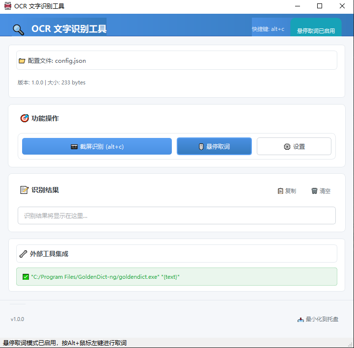
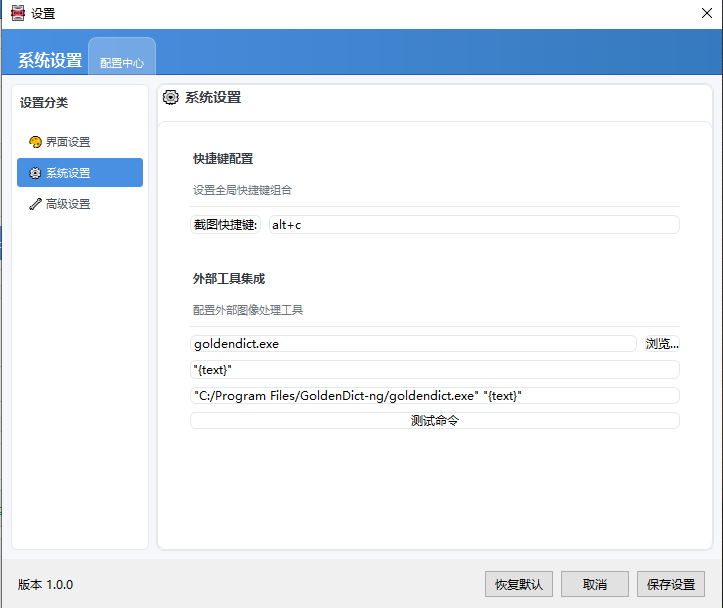

## OCR-Tool【WIP】

### 项目初心

以前电脑上一直使用的欧路词典，虽然欧路词典可以配置第三方词典，但集成了太多自己用不到的功能，因此打算换一个比较纯粹的离线词典软件，搜索一番后发现了
GoldenDict-ng([freemdict](https://forum.freemdict.com/)上找到的)，因此切换到了这个软件上面，但是开发者推荐的Windows上的Caputer2Text
使用的OCR技术为Tesseract，识别中文效果一般，因此打算基于PaddleOCR/RapidOCR开发一款类似Caputer2Text的软件。

freemdict上有一些质量上层的中英文词典，不用注册账号，可直接下载，此处给出几款词典的链接(不定期更新)：

+ [精装 - 牛津高阶双解第10版完美版（OALDPE）](https://forum.freemdict.com/t/topic/30466)
+ [现代汉语词典第7版-20240219更新](https://forum.freemdict.com/t/topic/12102)

### 功能

一个OCR小工具，可以和[goldendict-ng](https://github.com/xiaoyifang/goldendict-ng)搭配使用

利用LLM(Claude/ChatGPT，非Cursor/Trae/Github Copilot)，与AI结对编程，共同完成了此项目

支持的核心功能：
1. `alt+c`进行截图取词
2. `alt+鼠标左键`进行悬停取词(需要在软件中开启此功能)

注意:
1. 支持跨平台使用，Windows系统和MacOS系统
2. MacOS有自己的一套OCR技术，可参考[Shortcuts.app & Apple's OCR](https://xiaoyifang.github.io/goldendict-ng/howto/ocr/#shortcutsapp-apples-ocr)

鸣谢下列开源软件提供核心技术:
+ [PaddleOCR, v5版本](https://paddlepaddle.github.io/PaddleOCR/main/quick_start.html)
+ [RapidOCR](https://rapidai.github.io/RapidOCRDocs/main/)

### 界面







## TODO
- [x] 调研RapidOCR(相对PaddleOCR推理加速，降低延迟)
- [x] 重构热键管理，支持Mac和Windows
- [ ] 优先保证Windows下功能正常
- [ ] 验证在MacOS下软件功能是否正常
- [ ] 打包方式完善
- [ ] 增强ocr_engine参数配置，使其更灵活，比如用户决定使用PPOCRV4还是PPOCRV5
- [ ] 兼容CPU和GPU的ocr_engine，根据用户配置决定使用哪个版本(优先使用CPU，对配置要求低，更加通用)
- [x] 将部分参数配置化
- [x] GUI美化，保持界面风格一致
- [ ] 结果预览界面增强，增加查看原图和上报误判功能
- [ ] 如果OCR取词出现同分数，考虑是否返回多个，让用户决定，还是扩大截图范围，通过上下文语义来决定结果
- [ ] 配置升级过程可以安排在程序启动时，启动有个进度条，这个进度条的进度和启动过程中要做的事情有关系

## 安装依赖
```bash
pip install -r requirements.txt
```

## 打包
```bash
pyinstaller --name="OCR-Tool" --icon _internal/ocr.png --windowed --onefile --collect-all paddleocr main.py
```
or

```bash
pyinstaller OCR-Tool.spec --clean -y
```

项目里已生成好OCR-Tool.spec文件，推荐直接使用后者来打包

## 遇到的问题
1. 打包时Cython依赖不全(已在OCR-Tool.spec中处理该问题)
2. 程序版本升级，如何对用户的旧配置进行升级(已在settings_manager中处理该问题)
3. PaddleOCR的server版在Windows下有卡顿，考虑2种方式改善(已在ocr_engine处理该问题)：
    + 3.1 使用mobile版模型，需要多测试看看准确率如何
    + 3.2 使用RapidOCR 

